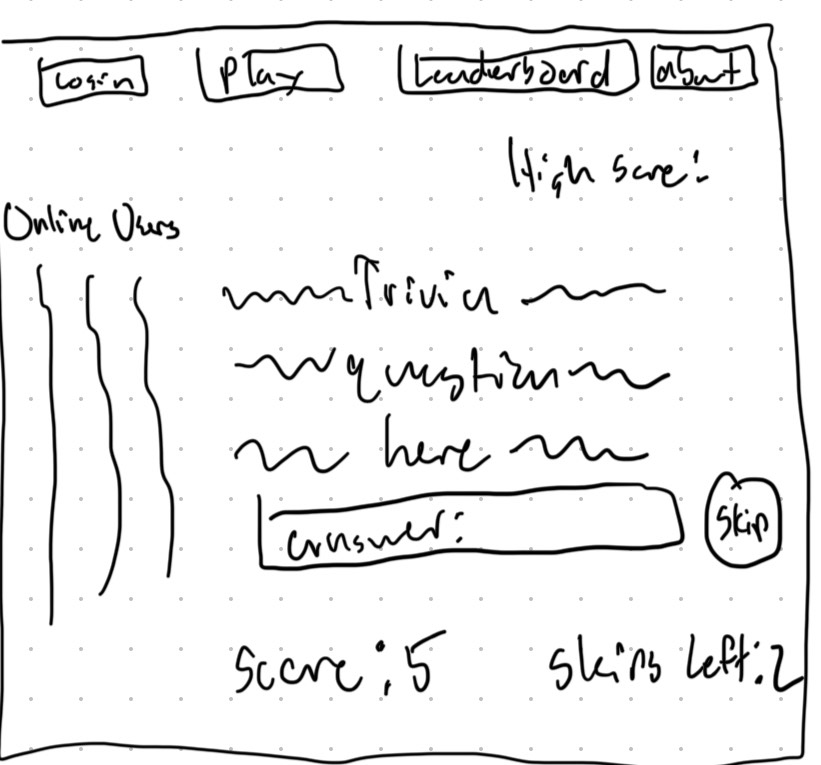
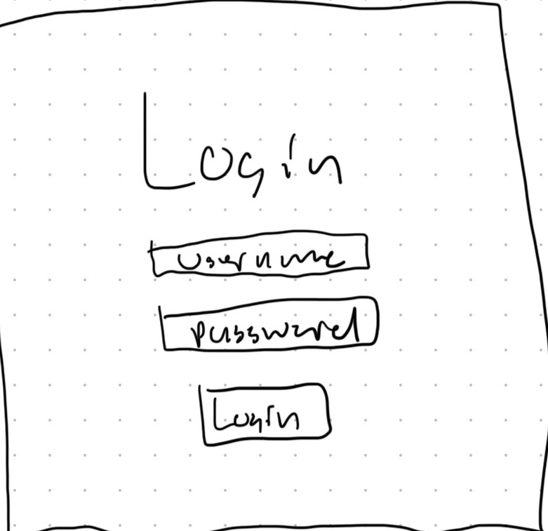
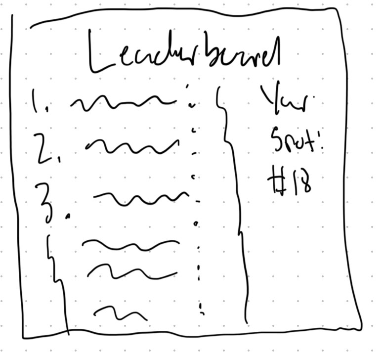

# Trivia Survival

[My Notes](notes.md)

Trivia Survival is an application for building a high score, and seeing how you compare with other users. You are continuously fed trivia questions, one after another, and as soon as you miss one, your game ends and you are ranked on the leaderboard. To help you score high, you are equipped with 3 skips, that lets you avoid answering a question you don't know. Make sure you answer quickly, because each question has you on a time limit, and if you don't answer in time, you lose!

## 🚀 Specification Deliverable

For this deliverable I did the following. I checked the box `[x]` and added a description for things I completed.

- [x] Proper use of Markdown
- [x] A concise and compelling elevator pitch
- [x] Description of key features
- [x] Description of how you will use each technology
- [x] One or more rough sketches of your application. Images must be embedded in this file using Markdown image references.

### Elevator pitch

Do you believe your knowledge of trivia is unmatched? Now is your chance to prove it! With Trivia Survival, you engange in an endless guantlet of trivia questions, in an attempt to reach the highest score! Be careful though, as if you get a single question wrong, your game immediately ends! At your disposal is 3 skips to let you get past the really difficult questions. Once you've lost, your score is put onto the leaderboard, and you can see how you rank compared to everyone else. Let's see if you are really as good as you say you are!

### Design

### Key features

- Secure login
- Trivia questions pulled from API
- Ability to answer Trivia question
- Online users and their current scores displayed
- Ability to see your current score and high score
- Ability to skip question, to a maximum of 3 times
- Viewable leaderboard ranking all users by their high score

### Technologies

I am going to use the required technologies in the following ways.

- **HTML** - 4 html pages - One for login, one for an about page, one for a gameplay page, one for a leaderboard page
- **CSS** - Style the application, reformat screen size for different devices
- **React** - Provides the login, Displaying other users active scores, display new trivia questions, handle the user's input of answer, handle the user's use of a skip, routing and components
- **Service** - Backend service with endpoints for: Login/Logout support, storing user scores, recieving user answers, retrieving trivia questions from public API
- **DB/Login** - Store the users, store the high scores of all players
- **WebSocket** - As an online user is currently playing, their current score is broadcast to all other players.

## 🚀 AWS deliverable

For this deliverable I did the following. I checked the box `[x]` and added a description for things I completed.

- [x] **Server deployed and accessible with custom domain name** - [My server link](https://triviasurvival.click).

## 🚀 HTML deliverable

For this deliverable I did the following. I checked the box `[x]` and added a description for things I completed.

- [x] **HTML pages** - I have 4 different html pages. An index one which is the home page and login, a leaderboards one, an about one, and a play one.
- [X] **Proper HTML element usage** - Each page uses header, body, and footer tags. For my headers, I included the link navigations in a menu and nav element. I used form for retrieving user login. I also used a table and bullet lists. For text I used headings, paragraphs, and span tags. Divs were used to arrange elements neatly. 
- [X] **Links** - The header of each page includes links to all of the pages.
- [X] **Text** - I have headers to signify the sections, and placeholder text for all scores, usernames, questions, etc.
- [X] **3rd party API placeholder** - Third party calls will be made to retrieve trivia questions. For now I have manually put in one question as a placeholder
- [X] **Images** - I placed a logo image in the about page of my website.
- [X] **Login placeholder** - I used a form and have placed all input elements. Option to eather create account or login exists. Structure is all there, just awaiting implementation.
- [X] **DB data placeholder** - My leaderboard page features a table to display data. Currently has manually inputed data as a placeholder
- [X] **WebSocket placeholder** - My play page has a section that shows the other online users and their current scores.

## 🚀 CSS deliverable

For this deliverable I did the following. I checked the box `[x]` and added a description for things I completed.

- [X] **Header, footer, and main content body** - Every page contains the header and fooder, and the main content for it (leaderboard, trivia play area, about page, login). The header uses a pill navbar from bootstrap, and my footer shows me as the creator, and includes a link to my github. 
- [X] **Navigation elements** - Pill navbar, the current page your on remains highlighted in the navbar, and hovering over the other options changes the color.
- [X] **Responsive to window resizing** - Footer disappears if the screen height gets too small, on the play page the online users info and your high score info will go if screen is small, leaderboard will remove your rank info depending on window size, and the about page removes the text logo image when the screen gets too low height wise. 
- [X] **Application elements** - Used forms, buttons, links, navbars, input fields, tables, headings, and more
- [X] **Application text content** - Used heading and paragraph tags, styled it using bootstrap. Some textual content retains its h class, others use bootstraps display class.
- [X] **Application images** - The about page contains an img in the form of a text logo for the site. Will remove itself when the screen gets too small to support it.

      Application is styled using mostly bootstrap and the style attribute in tags, but the main.css stylesheet on all pages has a couple important selectors.

## 🚀 React part 1: Routing deliverable

For this deliverable I did the following. I checked the box `[x]` and added a description for things I completed.

- [ ] **Bundled using Vite** - I did not complete this part of the deliverable.
- [ ] **Components** - I did not complete this part of the deliverable.
- [ ] **Router** - I did not complete this part of the deliverable.

## 🚀 React part 2: Reactivity deliverable

For this deliverable I did the following. I checked the box `[x]` and added a description for things I completed.

- [ ] **All functionality implemented or mocked out** - I did not complete this part of the deliverable.
- [ ] **Hooks** - I did not complete this part of the deliverable.

## 🚀 Service deliverable

For this deliverable I did the following. I checked the box `[x]` and added a description for things I completed.

- [ ] **Node.js/Express HTTP service** - I did not complete this part of the deliverable.
- [ ] **Static middleware for frontend** - I did not complete this part of the deliverable.
- [ ] **Calls to third party endpoints** - I did not complete this part of the deliverable.
- [ ] **Backend service endpoints** - I did not complete this part of the deliverable.
- [ ] **Frontend calls service endpoints** - I did not complete this part of the deliverable.
- [ ] **Supports registration, login, logout, and restricted endpoint** - I did not complete this part of the deliverable.

## 🚀 DB deliverable

For this deliverable I did the following. I checked the box `[x]` and added a description for things I completed.

- [ ] **Stores data in MongoDB** - I did not complete this part of the deliverable.
- [ ] **Stores credentials in MongoDB** - I did not complete this part of the deliverable.

## 🚀 WebSocket deliverable

For this deliverable I did the following. I checked the box `[x]` and added a description for things I completed.

- [ ] **Backend listens for WebSocket connection** - I did not complete this part of the deliverable.
- [ ] **Frontend makes WebSocket connection** - I did not complete this part of the deliverable.
- [ ] **Data sent over WebSocket connection** - I did not complete this part of the deliverable.
- [ ] **WebSocket data displayed** - I did not complete this part of the deliverable.
- [ ] **Application is fully functional** - I did not complete this part of the deliverable.
